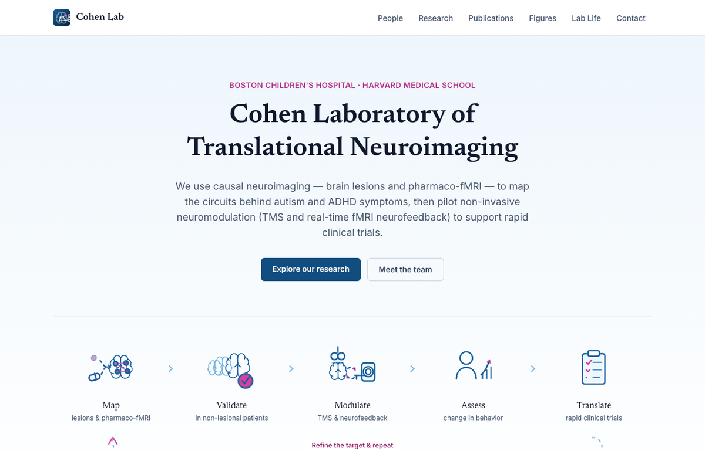
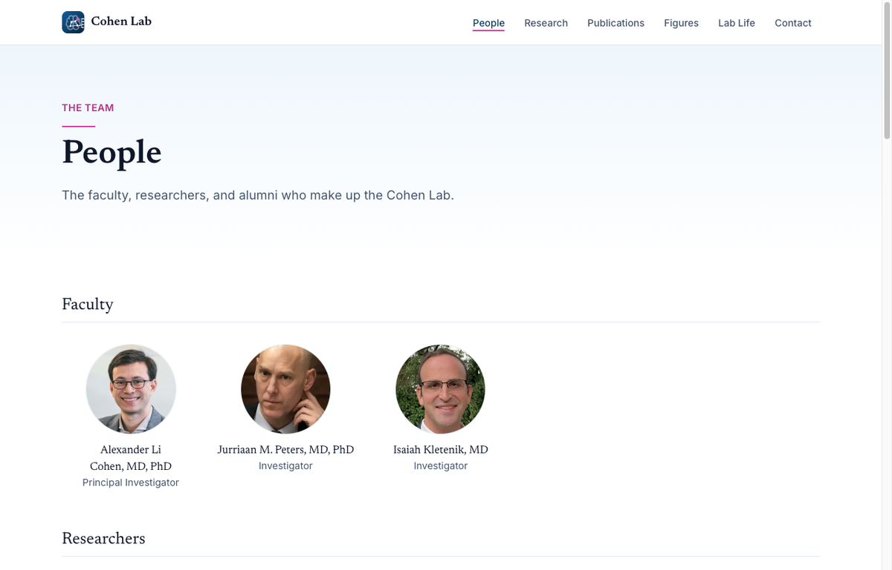
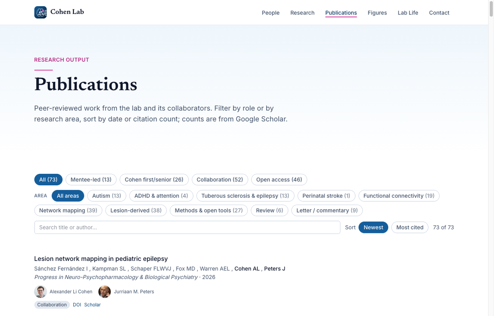
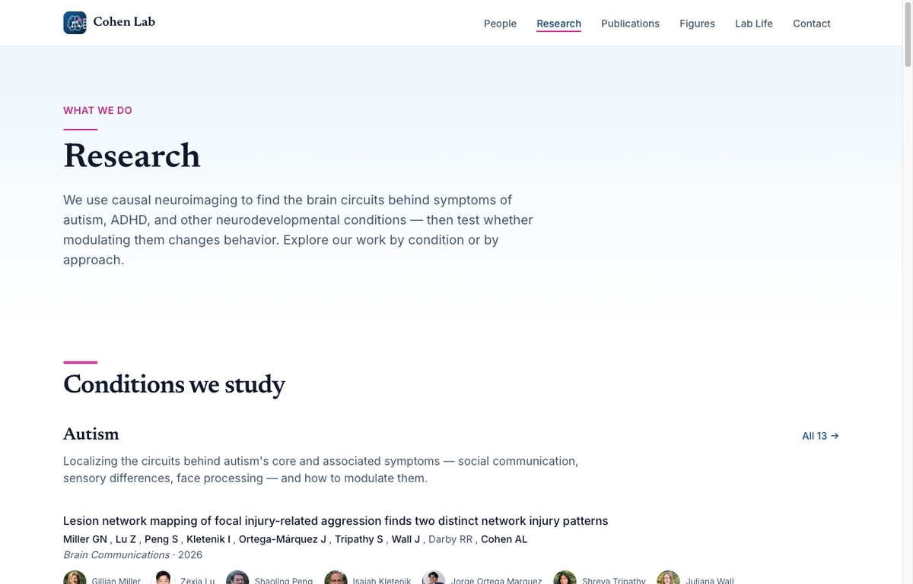
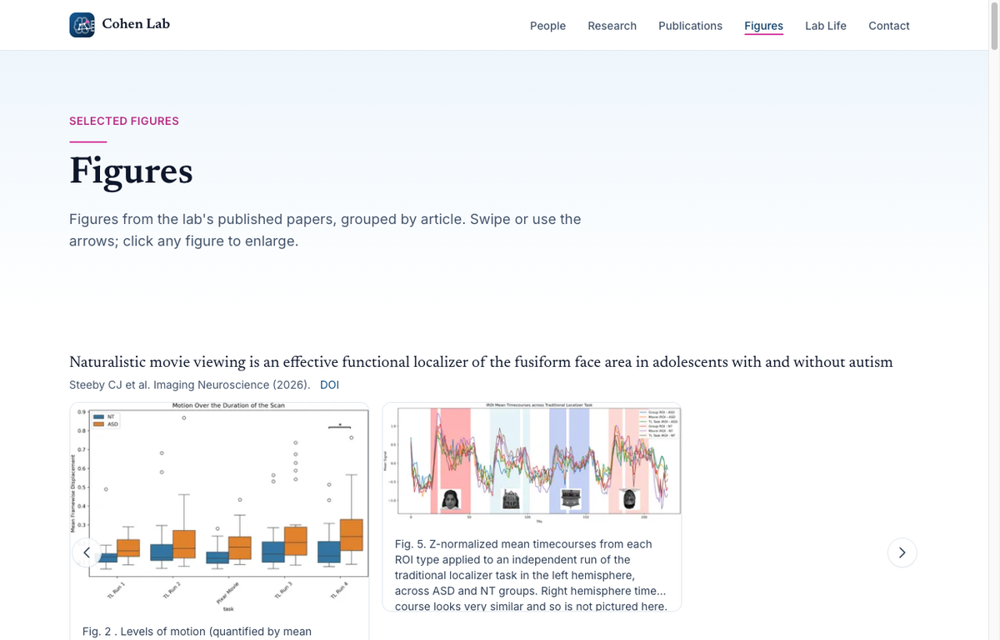

# Lab website template

A modern, content-driven **research-lab website** built with **[Astro](https://astro.build) +
[Tailwind CSS v4](https://tailwindcss.com)**, designed to deploy free to **GitHub Pages**. It's
made to be customized *with [Claude](https://claude.com/claude-code)* — point Claude at your CV and
roster and it fills in the content for you.

> This is a starter template. It ships with placeholder content so it builds and deploys out of the
> box. Replace the placeholders with your lab's details (see **[SETUP.md](./SETUP.md)** and
> **[CLAUDE.md](./CLAUDE.md)**).

## 🔗 Live example

See the template running in production — the [Cohen Laboratory of Translational
Neuroimaging](https://bchcohenlab.com) site it was built from:

### 👉 **[bchcohenlab.com](https://bchcohenlab.com)**

[](https://bchcohenlab.com)

| People | Publications (filter · search · sort) |
| :----: | :-----------------------------------: |
| [](https://bchcohenlab.com/people) | [](https://bchcohenlab.com/publications) |
| **Research (grouped by topic)** | **Figures (copyright-gated)** |
| [](https://bchcohenlab.com/research) | [](https://bchcohenlab.com/figures) |

*(Your site starts from neutral placeholder content — the screenshots above show a fully
populated example.)*

## What you get

- **Pages:** Home, People (per-person profiles with brand-icon social links + LinkedIn/ORCID badges
  on the roster), Research (grouped by topic/approach), Publications (filter by role/topic + search +
  sort), Figures (copyright-gated), Lab Life (photo gallery with lightbox), Contact (map + links),
  and a 404.
- **Content as Markdown** via Astro content collections (`src/content/`) with typed schemas —
  no database, no CMS required (a CMS can be layered on later with no schema change).
- **A research-topic taxonomy** that auto-groups the Research page and drives Publications filters.
- **Image optimization** built in (Astro `<Image>` → responsive WebP).
- **Automatic citation counts** — an optional weekly GitHub Action refreshes per-paper Google
  Scholar counts via SerpAPI.
- **Profile-link enrichment** — `npm run enrich:orcid` fills in each person's ORCID iD by
  cross-referencing your own publications' author metadata (Crossref + PubMed), no searching.
- **Copyright-safe figures** — figures are hidden unless you explicitly set `rightsConfirmed: true`.
- **One-click deploy** to GitHub Pages via GitHub Actions (works with a custom domain or a
  `username.github.io/repo` project page).

## Quick start

```bash
npm install
npm run dev        # http://localhost:4321
```

Then customize: edit `src/data/site.ts`, swap the content in `src/content/`, and replace the
placeholder favicon in `public/`. The fastest path is to **ask Claude** — see
**[CLAUDE.md](./CLAUDE.md)** for a guided, copy-pasteable workflow.

To go live, follow **[SETUP.md](./SETUP.md)** (GitHub Pages + optional custom domain + the
citation-refresh secret).

## Customize it with Claude Code

This template is built to be filled in by **[Claude Code](https://claude.com/claude-code)** —
Anthropic's terminal coding agent (it's what built the template). It reads the included
[`CLAUDE.md`](./CLAUDE.md) automatically, so you describe your lab in plain English and it edits
the files for you.

**1. Install Claude Code** (requires a paid Claude plan — Pro/Max/Team/Enterprise — or API access):

```bash
# macOS / Linux / WSL  (recommended)
curl -fsSL https://claude.ai/install.sh | bash

# …or Homebrew
brew install --cask claude-code

# …or npm  (needs Node 18+)
npm install -g @anthropic-ai/claude-code
```

Windows PowerShell: `irm https://claude.ai/install.ps1 | iex`. Other options:
the [setup guide](https://code.claude.com/docs/en/setup).

**2. Open the project and start Claude:**

```bash
cd your-repo
npm install
claude            # first run opens a browser to sign in
```

**3. Give it your first task.** Claude reads `CLAUDE.md`, so just tell it about your lab:

> Read CLAUDE.md, then set this site up for my lab. Lab name "Example Lab", PI Jane Doe at Some
> University. Here's my CV (attached) — fill in `src/data/site.ts`, create my people and
> publications, and use these research topics: X, Y, Z. Then run `npm run dev` so I can preview it.

**4. Iterate in plain English** — *"add my headshot," "make the accent color teal," "import my
newest papers," "design a logo for my lab."* Keep `npm run dev` running in a second terminal to
watch changes live at http://localhost:4321.

➡️ See **[CLAUDE.md](./CLAUDE.md)** for the full step-by-step prompt set (identity, taxonomy,
people, publications, figures, logo/hero, deploy).

## Commands

| Command           | Action                                              |
| :---------------- | :-------------------------------------------------- |
| `npm install`     | Install dependencies                                |
| `npm run dev`     | Start the local dev server at `localhost:4321`      |
| `npm run build`   | Build the production site to `./dist/`              |
| `npm run preview` | Preview the production build locally                |
| `npx astro check` | Type-check `.astro` files and content frontmatter   |

## Project layout

```
src/
  content/        people · publications · figures · gallery  (your content, as Markdown)
  content.config.ts   collection schemas + the research-topic vocabulary
  data/site.ts    site identity, contact, nav  ← EDIT THIS FIRST
  lib/content.ts  taxonomy labels/groups + query helpers
  components/     layout + UI (incl. PipelineHero.astro — an example custom hero)
  pages/          one file per route
public/           favicon set, CNAME, robots.txt
scripts/          optional helpers (citation refresh, ORCID enrichment, link check, CV importer)
.github/workflows/ deploy.yml (Pages) + refresh-citations.yml (weekly Scholar counts)
```

## ⚠️ A note on figure copyright

The `figures` collection is **gated**: a figure renders only if its frontmatter says
`rightsConfirmed: true` (the default is `false`, fail-closed). Journal figures are usually
copyrighted — only mark `rightsConfirmed: true` for figures you have the right to post (open-access
/ CC-licensed, or your own author-reuse rights). Don't post other people's figures.

## Feedback & contributing

Found a bug or a rough edge **in the template itself** (not your own content)? Please report it on
the [upstream repo's Issues](https://github.com/bchcohenlab/lab-website-template/issues), or open a
PR. If you're working in Claude Code, it can file the issue or PR for you — see the
*"Hit a bug in the template?"* section of [CLAUDE.md](./CLAUDE.md).

## Credit & license

Created by the [Cohen Laboratory of Translational Neuroimaging](https://bchcohenlab.com) and shared
as a template. MIT licensed — see [LICENSE](./LICENSE). The placeholder content and images are
filler; replace them with your own.
